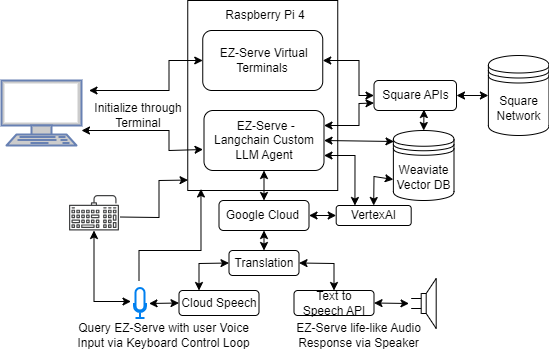
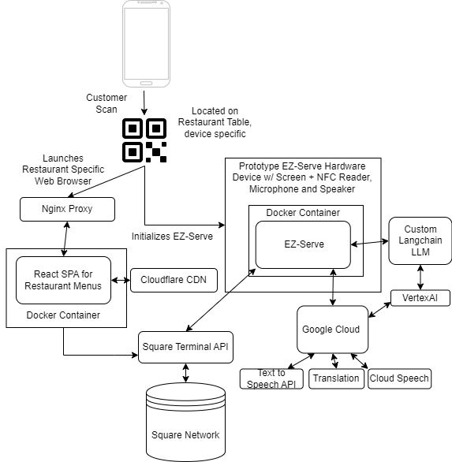

# EZ-Serve
Your AI server! Built for the Square + Google AI hackathon. Everything is intended to run off a raspberry pi.


## Features
- Place orders directly to Square using natural speech.
- Multi-language support for input/output speech.
- Error handling for ambiguous orders.

## Future Improvements
- switch text-to-speech to something more natural (https://coqui.ai/?)
- use whisper.cpp for local transcription. (faster, if possible)
- Further optimize the agent's prompt/template.
- Predictive Analytics & Demand Forecasting

## Challenges
We encountered many challenges throughout development. Listed below are many of the software and hardware challenges we encountered during the development process, these include:
- Initially we performed a bunch of regex and brute-forced a list to find order items
  - upgraded to a vectordb.
- Many of issues minimizing the amount of text going through the LLM
  - changed to a custom agent framework to batch order calls.
- Langchain agent prompt has a character limit.
- The first version of the agent would call order_tool for each individual item, this was an inefficient use of LLM calls so we converted order_tool to accept a list of items. This drastically improved the speed of the program and lowered calls.
- We realized that any agent that has to interact with humans is going to encounter plenty of edge cases that we didn’t have the time to exhaust, so we implemented plenty of error checking, and eventually saw the need for human-in-the-loop validation
- Mapping windows ports to unix ports.
- Unable to test Square Webhooks using zapier without production account.
- ALSA audio configuration was painful.
- Raspberry pi has a maximum power ouput
  - can't use a 70" tv as a monitor lol
- Difficulties outputting audio from .wav files
  - Some things work, and dont work, in Python. Everything, mostly, works in Python3.
- Geany IDE doesn't like the simultaneous use of spaces and tabs.


## Architecture

### Current State - High Level Architecture


### Ultimate Concept - High Level Architecture


## Installation - Linux

<b>NOTE: The project submission runs off a Raspberry Pi 4 with specific ALSA audio configuration.</b>

1. From EZ-Serve root folder, initialize `.env` with env variables (example at .env.sample) 
2. ```pip install virtualenv```
3. `virtualenv venv`
4. `source venv/bin/activate`
5. `pip install -r requirements.txt`
6. Proceed to <b>Run</b> and follow instructions. If any erros related to audio arise, device configuration may be required for the specific OS. To resolve, query audio sinks/sources, determine audio protocol and configure for desired OS.


## Installation - Windows

<b>NOTE: audio is not supported on windows. you can still place orders to square via text in main.py</b>

1. From EZ-Serve root folder, initialize `.env` with env variables (example at .env.sample) 
2. ```git clone https://github.com/vaughanlove/EzServe```
3. Switch to `windows` branch
4. ```python3 -m venv venv```
5. ```.\venv\Scripts\activate```
6. ```python3 -m pip install -r .\requirements.txt```

## Run 

If you want to run the bot:                 `python3 app/main.py` 

(specifically python3)

If you want to work with the notebooks:  `pip install jupyterlab`, then  `jupyter lab`

## TODO

## In progress

- [x] Documentation + Demo
## Completed

- [x] Add human in the loop validation
- [x] Further customize agent template 
- [x] Create virtual terminal for visualizing results.
- [x] Documentation
- [x] Create custom langchain agent.
- [x] Make bot event loop robust.
- [x] Custom agent class.
- [x] Agent/Transcription error handling.
- [x] Add multi-language support.

## Formatting

Following Google's python style guide: [Google PyGuide](https://google.github.io/styleguide/pyguide.html)
(changed indent from 2 spaces to 4.)
